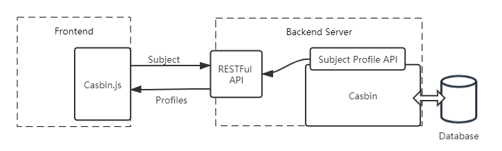

# Extend Casbin to the Frontend
This is the proposal for Casbin organization in GSoC 2020.

## Introduction
Hi, my name is Zihui Liu. I am currently a senior student in Sun Yat-Sen University. I am proficinet in full-stack development. You can view [my resume](https://kingiw.github.io/resume-en/) for further information. 

## Abstract

Casbin is an authentication library. Its support for diverse programming languages, different access control models and powerful adapters gains it the greatest popularity in the open source community. However, there are still lots of difficulty in utilizing Casbin at the frontend. In the GSoC 2020, I wish to implement a friendly JS library and other supported facilities to extend Casbin at the frontend development.

## Similar Products
[Casl](https://stalniy.github.io/casl/) is an isomorphic authorization Javascript library. It provides an isomoorphic API and it is friendly to be used in many Javascript environments, like Express and many other web-service frameworks. It also provides web components in prevalent frontend frameworks including Vue.js and React.

[Vue-Access-Control](https://github.com/tower1229/Vue-Access-Control) is a solution of front-end user rights control based on Vue/Vue-Router/axios,through the control of three levels of routing, view and request, the developer can realize the user authority control of any granularity.

## Goals
1. Provide an interface in Casin to generate the subject-profiling data. Users can deploy their own RESTFul API to implement the data transmission between the frontend application and the backend server with Casbin installed.

2. Develop a Javascript library (aka Casbin.js) to provide the powerful but foolproof functionalities to control the properties like the visibility of UX widgets, dynamic routers and private data accessibillity at the frontend. 

<center>


Basic Schema

</center>
3. Design out-of-the-box Casbin components in prevalent frontend frameworks including React, Vue.js, Angular.js.

```jsx
// An imaginary component in React
import { isAllowed } from "@casbin/react" 

ReactDOM.render(
    <isAllow role="admin" other_props="...">
        <p>Only render this DOM if the user has the accessibility.</p>
    </isAllow>
)
```

## Demo
Temporarily I wrote a [demo](https://github.com/kingiw/casbin-js-demo) for Casbin.js. It builds a web service with Beego and uses Casbin to manage users' accessibility with an RBAC model. At the frontend, [Casbin.js](https://github.com/kingiw/casbin-js-demo/blob/master/static/js/casbin.js) is referred as a JS library in the views template. By calling a simple function, Casbin.js automatically fetch subjects' profiles from the backend RESTFul API and asynchronously refresh the HTML DOM elements on the page. I believe this demo could be a kickstart for the project.

## Proposal Timeline

#### Before May 4 (Date of Student Annoucement)
1. Learn everything about Casbin, including but not limited to its internal implementation, its users' requests.
2. Maintain a demo for Casbin.js.
3. Learn more about the features and the principle of modern web frontend frameworks.
4. Review PRs in casbin projects(not limited to Casbin.js) and get close connection with mentors, which can get me more familiar with Casbin.

#### May 4 - May 31 (Community Bonding Period)
1. Review my demo project and have a brain storm with my mentor. This will be helpful for consensus on the final demands.
2. Define the basic framework of Casbin.js, including the interface of functionalities and the implementation principles.
3. Determine the used toolchain, including the development patterns and the unit testing.

#### June 1 - July 3 (Before the First Evaluation)
1. Do the implementations on Casbin Javascript library.
2. Design the intergrated components in one of the modern frameworks (probably React).

#### July 4 - July 31 (Before the Second Evaluation)
1. Further improvement of Casbin Javascript library.
2. Port the designs and functionalities support in the previously chosed modern framework to other framework.
3. Finsh the documentation.

#### August 1 - August 31 (Before the Final Evaluation)
1. Continue with the unfinished tasks and improvement of the project.
2. (If available) pay attention to other Casbin project.  

#### After GSoC
I will continue maintaining the project after the end of GSoC. Hopefully I can be a member of Casbin Organization and get actively involved in the open source community.